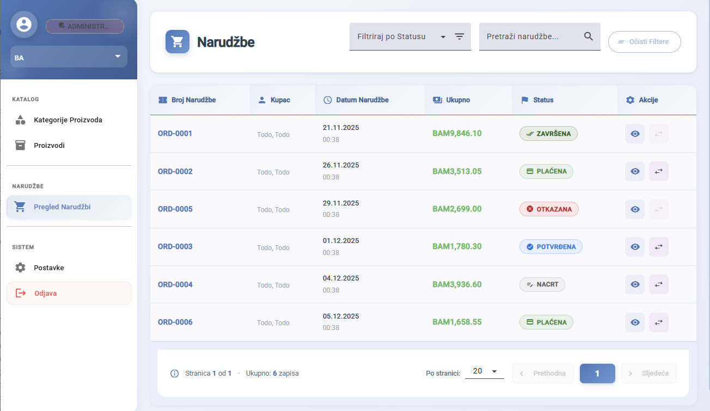
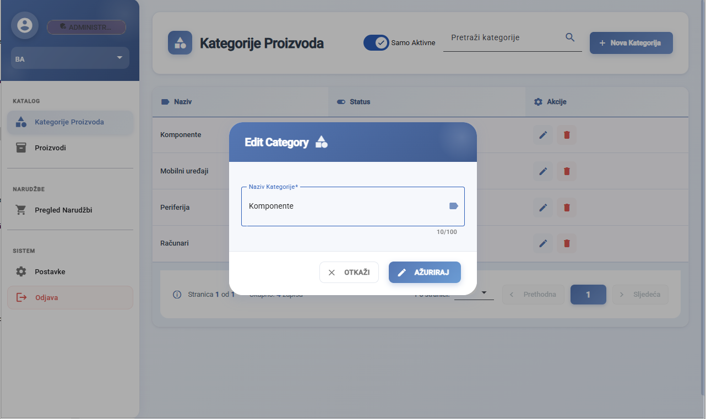
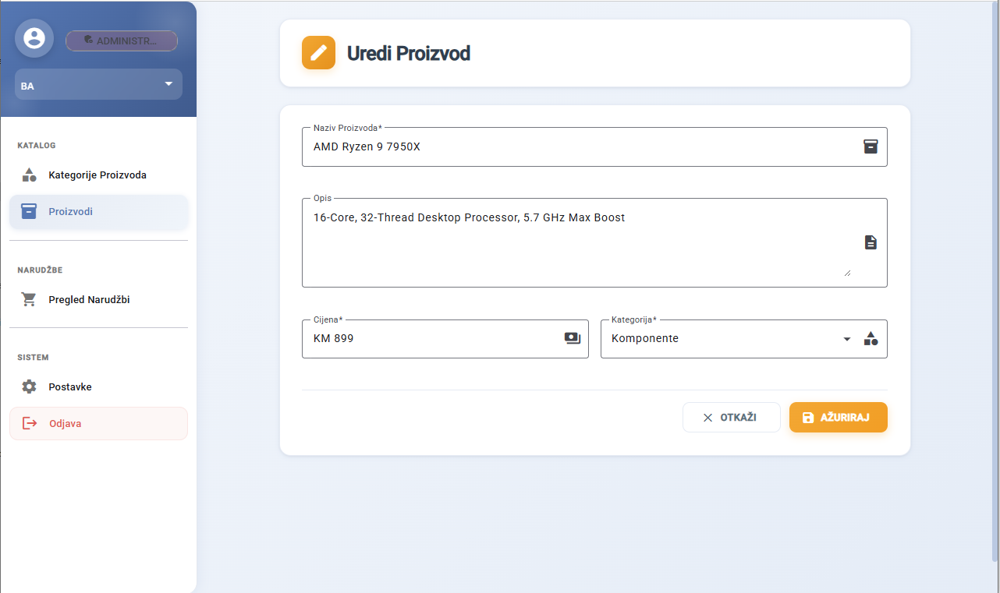
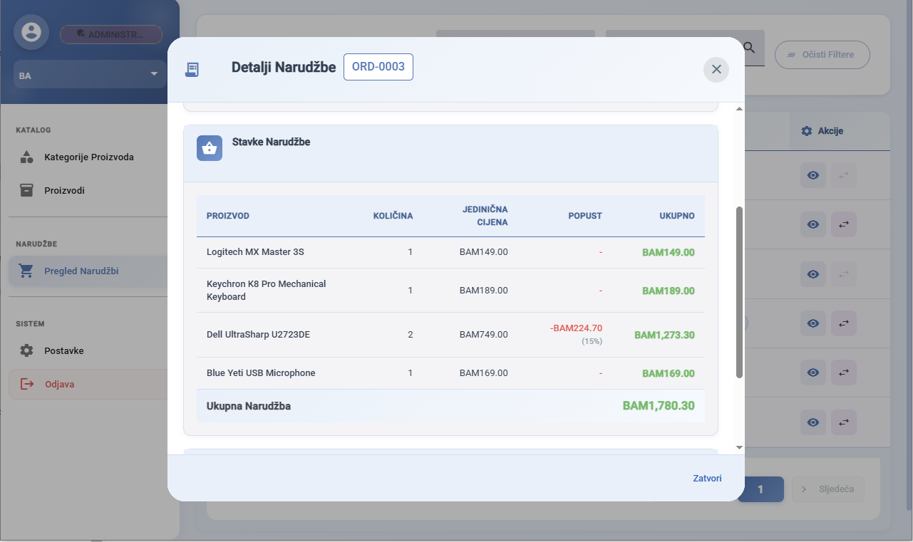
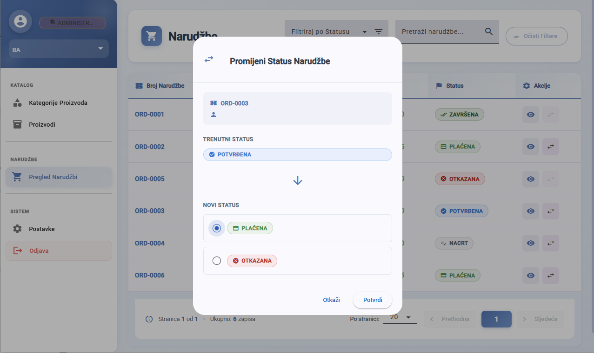

# Market Frontend - Brzi Vodič

Angular admin panel za upravljanje proizvodima i narudžbama.

---

## ⚡ Brzo Pokretanje

### Preduvjeti
- Node.js 18+
- Backend API mora biti pokrenut na `https://localhost:7260`

### Instalacija i Pokretanje

```bash
# 1. Instaliraj dependencies
npm install

# 2. Pokreni development server
npm start
```

**Aplikacija će se otvoriti na**: `http://localhost:4200`

---

## 🔐 Pristupni Podaci

```
Email: admin@market.local
Lozinka: Admin123!
```

Ostali korisnici:
- `manager@market.local` / `Manager123!`
- `employee@market.local` / `Employee123!`
- `string` / `string` (za Swagger testiranje)

---

## 📁 Mogućnosti

✅ **Kategorije Proizvoda** - CRUD operacije  
✅ **Proizvodi** - Kompletan menadžment sa zalihama i cijenama  
✅ **Narudžbe** - Pregled, filtriranje, promjena statusa  
✅ **Višejezičnost** - Engleski i Bosanski  
✅ **Responsive** - Mobilni, tablet, desktop  

---

## 🛠️ Komande

```bash
npm install          # Instaliraj dependencies
npm start            # Pokreni dev server (port 4200)
ng build             # Build za produkciju
```

---


## 📸 Screenshotovi

### Prijava


### Kategorije Proizvoda


### Upravljanje Proizvodima


### Narudžbe Dashboard


### Detalji Narudžbe


### Promjena Statusa Narudžbe


---

